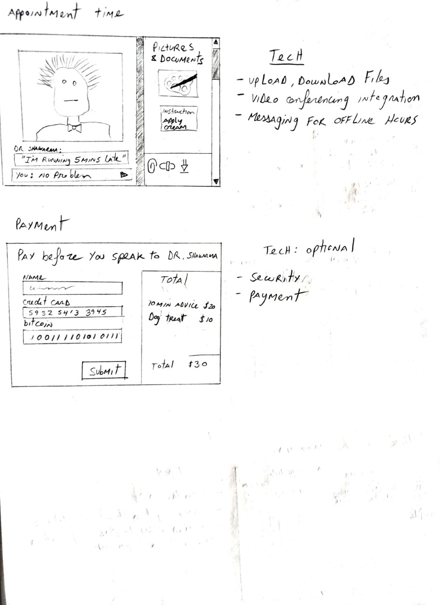

# tele-vet

## Who are we?

Kaavya: r2q7
Amy: U5X9A
Francois: j1h1b
Nick: t9f2b

## Who is this for?

Tele-Vet is a tele-health web app designed to connect vets with their furry patients. There are two use cases:
(1) Pet owners who want to meet their vet virtually.
(2) Vets who want to meet their patient or take on new patients virtually.

## What will our app do?

It will connect vets and pet owners virtually with video conferencing and messaging. Users can sign in as either pet owner or vet. 
Pet owners can:
- Undergo a pre-screening using a chatbot to indicate the level of urgency and preliminary info
- Search for vets by location
- Book an appointment with a vet
- View a vet's availability
- Message vets in real-time
- Send and receive private messages to a message inbox
- Upload images
- Video conference with vets
- View message log history with vets
- Receive a summary of the appointment from the vet
- Receive prescriptions from the vet that can be downloaded as a pdf for printing and collecting

Vets can:
- Send and receive private messages to a message inbox
- View calendar and book patients through Google Calendar or Outlook or Apple Calendar
- View message log history with patients 
- Send notes and prescriptions
- View patient uploaded images
- View preliminary info on patients from pre-screening
- View existing patient files

## What type of data will we store?

We will store patient profile data: 
Pet Owners:
- Name
- Contact information
- Address
- Message History
- List of pets

Pets:
- Name
- Owner
- Species
- Breed
- Address
- Uploaded images
- Files (patient history, prescription history, pre-existing conditions, etc)

Vets:
- Vet name
- Clinic contact information
- Vet clinic location
- Address
- Uploaded images of the clinic or staff
- Staff profiles
- Some certificate prooving the vet is real
- Message history
- Prescription history etc

## What will users be able to do with the data?

Pet owners can retrieve message log, prescriptions and uploaded images. Vets can retrieve message log, patient file, and uploaded images.

## Additional functionality (contingent on time constraints)

## Minimal Requirements
- Database storage 
- User and vet accounts
- log in portal
- Search for vets by location (google map integration)
- View a vet's availability
- Booking/viewing appointment

## Standard Requirements
- Booking/viewing appointment
- Pre-screening chatbot
- Send and receive private messages to a message inbox
- Realtime messaging between patients and vets
- Embedded video portal
- Upload images

## Stretch Requirements
- Integrate booking with external calendars (google Cal, Outlook, Apple Cal)
- Payment integration
- Pre-screening chatbot

## Breakdown of minimal requirements
- Database Storage
    1. Set up a (mysql?) database
    2. Create a REST service in the backend that will provide endpoints for accessing the database, so we can access the
        data with frontend AJAX requests.

- log-in portal
    1. Choose an Oauth2.0 provider (Auth0 is free for up to 7k users https://auth0.com/). We don't want to manage this ourselves.
    2. Set up account (details depend on provider).
    3. Integrate into web app.

## Prototypes

